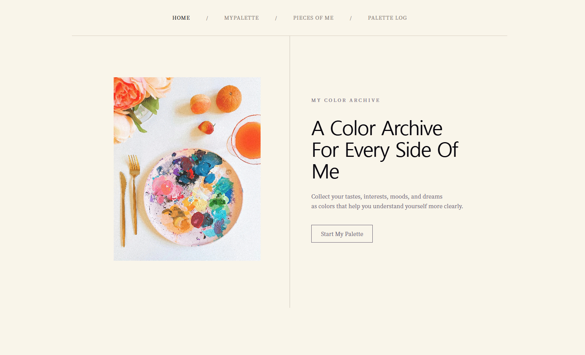
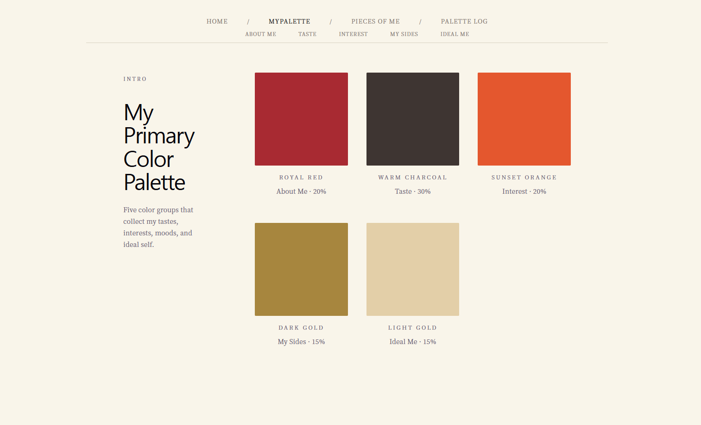
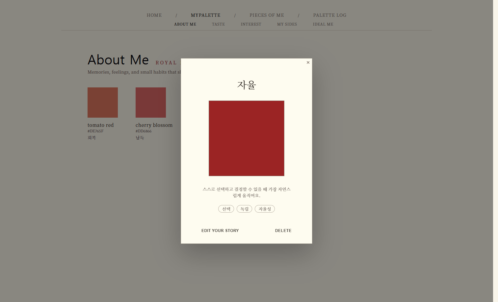
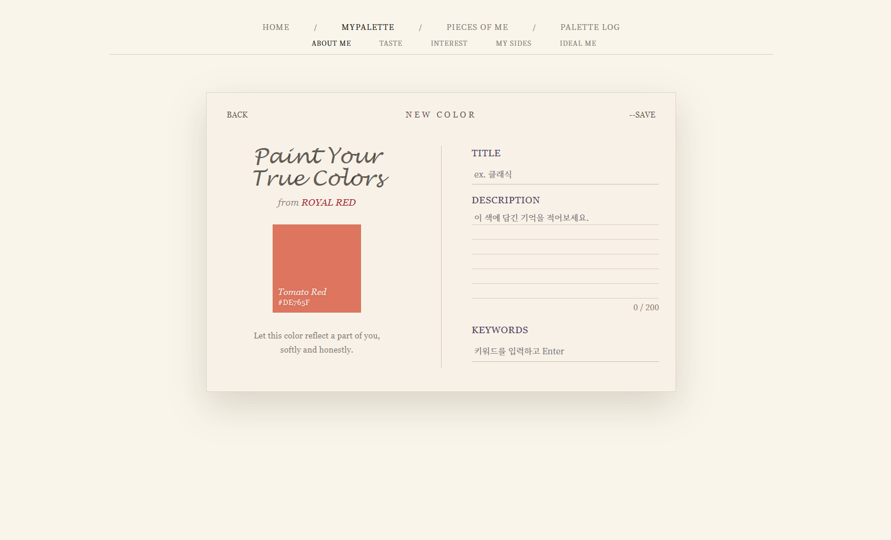

# MyPalette

> 취향, 성향, 관심사, 내면의 특징, 이상향을 색상 카드로 기록하고 카테고리별로 정리하는 React 기반 컬러 아카이브 웹 애플리케이션

## Links

- 배포 링크: [MyPalette](https://my-palette-six.vercel.app)
- GitHub Repository: [flux-hjkim/my-palette](https://github.com/flux-hjkim/my-palette)
- 테스트 계정: 없음
  - 현재 버전 기준 로그인 기능 미포함
  - 별도 계정 없이 주요 기능 확인 가능

---

## Project Overview

MyPalette는 사용자가 자신을 이루는 여러 요소를 색상 카드로 기록하는 자기 표현형 웹 애플리케이션.

단순 CRUD 연습을 넘어, 취향과 기억을 색상으로 분류하고 아카이빙하는 감성적 서비스 지향.

v1.0 단계에서는 React 기본기를 바탕으로 핵심 사용자 흐름(User Flow)을 완성하는 데 집중.

---

## v1.0 Goal

사용자가 컬러 그룹을 탐색하고, SubColor를 추가 / 수정 / 삭제하며, 상세 정보를 Modal로 확인할 수 있는 핵심 CRUD 흐름 완성.

v1.0의 핵심 목표:

- 컬러 그룹 탐색 흐름 구현
- 카테고리별 SubColor 관리 기능 구현
- Add/Edit 공용 Editor Page 구성
- 상세 정보 확인 Modal 구현
- React state, props, router 기반 데이터 흐름 정리
- 향후 확장을 고려한 createdAt 데이터 구조 유지

---

## Tech Stack

### React

- 컴포넌트 기반 UI 구성
- 재사용 가능한 Form, Card, Modal 구조 구현
- state와 props를 활용한 화면 간 데이터 흐름 관리

### React Router

- Home / MyPalette / Detail / Editor Page 라우팅 구현
- URL params 기반으로 category id와 subColor id 식별
- Add/Edit 화면 분기 및 저장 후 상세 Modal 복원 흐름 구성

### JavaScript

- 배열과 객체 기반 데이터 구조 관리
- map, filter, find 등을 활용한 CRUD 로직 구현
- Form validation 및 이벤트 처리 구현

### CSS

- 별도 UI 라이브러리 없이 직접 레이아웃과 스타일 구성
- editorial tone의 Home / MyPalette / Detail 화면 설계
- Modal, Editor Page, Color Picker, Card UI 스타일링

### Vite

- React 개발 환경 구성
- 빠른 개발 서버 실행 및 빌드 환경 사용

---

## Main Features

### Color Group

- 5개 카테고리 제공
  - About Me
  - Taste
  - Interest
  - My Sides
  - Ideal Me
- 각 카테고리별 대표 색상, 이름, 비율 정보 표시
- 카테고리 선택 시 상세 페이지 이동

### Pieces of Me

- 모든 카테고리의 SubColor를 한 화면에서 모아보기
- 카테고리별 컬러 개수와 비율 확인
- 컬러 스티커 hover 시 카테고리, 제목, keyword 표시
- 컬러 스티커 클릭 시 기존 Detail Modal 재사용
- 그룹을 선택하여 새로운 컬러 추가 가능
- 모바일에서는 보조 도구 영역을 접고 펼쳐 스티커 보드에 빠르게 접근

### SubColor CRUD

- 카테고리별 SubColor 목록 확인
- SubColor 추가
- SubColor 수정
- SubColor 삭제
- 저장 / 수정 / 삭제 결과 화면 반영

### Detail Modal

- SubColor 상세 정보 Modal 표시
- 컬러명, HEX 코드, 제목, 설명, keyword 확인
- Modal에서 Edit / Delete 진입 가능
- Modal 재진입 시 이전 메뉴 상태 초기화

### Editor Page

- Add/Edit 공용 Editor Page 사용
- 입력 영역과 컬러 preview 영역 분리
- 선택한 preset color preview 반영
- title / description 필수값 validation 적용
- description 200자 제한 적용

### Keyword

- Enter 입력으로 keyword 추가
- 공백 keyword 추가 방지
- 중복 keyword 추가 방지
- keyword tag 삭제 가능

### Data

- SubColor 생성 시 createdAt 생성
- SubColor 수정 시 기존 createdAt 유지
- 향후 Palette Log 기능 확장을 고려한 날짜 데이터 구조 준비

---

## Architecture / Key Decisions

### Add/Edit 공용 Form

입력 구조가 거의 동일한 Add/Edit 화면을 하나의 Form 컴포넌트로 재사용.

- 중복 UI 감소
- Add/Edit 입력 흐름 일관성 유지
- 이후 입력 항목 수정 시 한 곳에서 관리 가능

### Modal과 Page 역할 분리

상세 정보 확인은 Modal, 작성과 수정은 Editor Page로 분리.

- 확인 흐름과 입력 흐름의 역할 구분
- Modal 내부 복잡도 감소
- Editor Page 레이아웃 자유도 확보

### colorGroups state lifting

여러 페이지에서 동일한 컬러 데이터를 사용해야 하므로 colorGroups state를 상위 컴포넌트에서 관리.

- MyPalette / Detail / Editor 간 동일 데이터 공유
- Add/Edit/Delete 결과를 여러 화면에 일관되게 반영
- v1.0에서는 별도 상태관리 라이브러리 없이 React 기본 state 구조 유지

### URL params 기반 Add/Edit 분기

URL의 group id와 subColor id를 기준으로 현재 화면의 역할 구분.

- `/mypalette/:id/new` 기준 Add 모드 처리
- `/mypalette/:id/edit/:subColorId` 기준 Edit 모드 처리
- 라우팅 정보만으로 현재 group과 subColor 탐색 가능

### navigate state를 활용한 Modal 복원

Add/Edit 저장 후 navigate state로 `reopenSubColorId` 전달.

- 저장 후 방금 추가하거나 수정한 SubColor 상세 Modal 자동 오픈
- 사용자가 저장 결과를 바로 확인할 수 있는 흐름 구성

---

## Troubleshooting & Growth Points

### 1. Add/Edit Form 공통화

**Problem**

SubColor를 추가하는 화면과 수정하는 화면의 입력 구조가 거의 동일하여, 각각 별도 Form으로 관리할 경우 중복 코드가 늘어날 가능성 존재.

**Solution**

공통 입력 UI를 `SubColorForm` 컴포넌트로 분리하고, Add/Edit 화면에서 같은 Form을 재사용하도록 구성.

**Result**

- 입력 UI 중복 감소
- Add/Edit 화면의 입력 흐름 일관성 유지
- 이후 입력 항목이나 스타일 수정 시 한 곳에서 관리 가능

**Learning**

컴포넌트 재사용은 단순히 코드를 줄이는 것이 아니라, 같은 역할의 UI를 한 곳에서 관리하여 유지보수성을 높이는 설계 방식이라는 점 학습.

---

### 2. colorGroups 데이터 공유와 State Lifting

**Problem**

`MyPalette`, `ColorGroupDetail`, `ColorEditorPage`에서 동일한 컬러 데이터를 사용해야 하는 구조.  
각 컴포넌트가 별도의 state를 가지면 Add/Edit/Delete 결과가 화면마다 다르게 반영될 수 있는 문제 존재.

**Solution**

`colorGroups` state를 여러 페이지의 공통 부모인 상위 컴포넌트에서 관리하고, 필요한 페이지에 props로 전달.

**Result**

- Add/Edit/Delete 결과를 여러 화면에 일관되게 반영
- 카테고리 목록, 상세 페이지, Editor Page가 동일한 데이터 기준으로 동작
- v1.0에서는 별도 상태관리 라이브러리 없이 React 기본 state 구조로 데이터 흐름 구성

**Learning**

여러 컴포넌트가 같은 데이터를 사용해야 할 때는 가장 가까운 공통 부모로 state를 올리는 State Lifting 개념이 필요하다는 점 학습.

---

### 3. navigate state를 활용한 저장 후 UX 개선

**Problem**

SubColor를 추가하거나 수정한 뒤 상세 페이지로 돌아왔을 때, 사용자가 방금 저장한 결과를 바로 확인하기 어려운 문제 존재.

**Solution**

저장 후 `navigate()`의 `state`로 `reopenSubColorId`를 전달하고, 상세 페이지에서 해당 id를 가진 SubColor Modal을 자동으로 열도록 처리.

**Result**

- 저장 직후 방금 추가하거나 수정한 SubColor 상세 정보 자동 표시
- 사용자가 저장 결과를 즉시 확인 가능
- Add/Edit 이후의 사용자 피드백 흐름 개선

**Learning**

라우팅 이동 후에도 `navigate state`를 활용해 UI 상태를 복원할 수 있으며, 저장 이후의 피드백 흐름도 UX 설계의 일부라는 점 학습.

---

## Getting Started

```bash
npm install
npm run dev
```

---

## Current Limitations

- v1.0 기준 데이터는 React state로 관리
- 새로고침 시 사용자가 추가 / 수정 / 삭제한 데이터 유지 불가
- 모바일 Editor Page의 세부 반응형 레이아웃 개선 필요
- 로그인 및 사용자별 데이터 저장 기능 미포함

---

## Future Improvements

### v1.2

- Palette Log 페이지 추가
- createdAt 기준 월별 컬러 기록 표시
- 날짜별 컬러 클릭 시 기존 Detail Modal 재사용

### v1.3

- Pieces of Me 스티커 UI 고도화
- 다양한 frame과 hover interaction 추가

### v1.5

- TypeScript 마이그레이션
- ColorGroup / SubColor / PresetColor 타입 정의
- props와 selectedColor 구조 명확화

### v2.0

- Zustand 기반 상태 관리 리팩토링
- colorGroups 상태와 Add/Edit/Delete 액션 분리
- props 전달 부담 감소

### v3.0

- localStorage 기반 데이터 유지 기능 추가
- 새로고침 후에도 사용자 데이터 유지

### v4.0

- Firebase 또는 Supabase 연동 검토
- 사용자별 데이터 저장 구조 확장

---

## Screenshots

### Home



### MyPalette



### Color Detail Modal



### Color Editor


